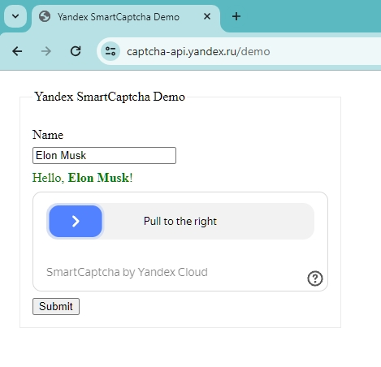

# Solving Yandex Smart Captcha using JavaScript (Puppeteer)

## Description

This demo shows you how you can automate solving Yandex SmartCaptcha. I solve captcha on https://captcha-api.yandex.ru/demo.
I use [Puppeteer](https://pptr.dev/) for make automation. 
The captcha is solved in the [2captcha.com](https://2captcha.com/) service, I get the result and use it on the page. To do this, you need to get the captcha parameters from the page, send them to the [2captcha.com](https://2captcha.com/) service, then apply the resulting token. Done.

For this example to work, you will need to enter your `apikey`. To do this, you need to register at [2captcha.com](https://2captcha.com/), and copy the `apikey` on the home page.
The service solves captchas for a fee, 1000 captcha solutions cost about 3$.

### Setup
Set `apikey` in `index.js` file

### Run

`npm install`

`npm run start`